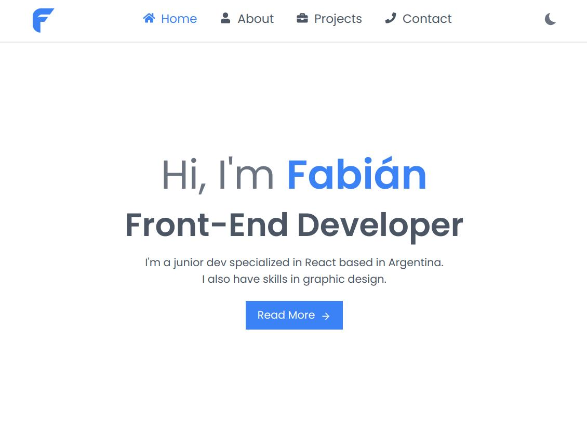

# My Portfolio

Welcome to my portfolio repository! This repository hosts the source code for my personal portfolio website, where you can explore my experience, projects, skills, and more. Visit the live site by clicking [here](https://vlas-dev.github.io/).



## 🌟 Features

- **Home:** Welcoming section with a brief introduction and navigation links.
- **About:** Learn more about me, my skills, and my journey as a front-end developer.
- **Projects:** Explore detailed descriptions and access links to the source code of my projects.
- **Contact:** Use the form to get in touch with me, or find additional contact details below.

## 🛠 Technologies Used

- HTML5
- CSS3
- JavaScript
- Tailwind CSS
- React

## 💻 Local Development

To run this project locally, follow these steps:

#### 1. Clone the Repository:
```bash
git clone git@github.com:vlas-dev/vlas-dev.github.io.git
cd portfolio
```
#### 2. Install Dependencies:
```bash
npm install
```
#### 3. Start the Development Server:
```bash
npm start
```

The site should now be running at http://localhost:3000.

## 🚀 Deployment
This site is hosted using GitHub Pages.

## 🤝 Contributions
While this is a personal project, if you find any bugs or areas for improvement, please feel free to open an issue or create a pull request.

## ✉️ Contact & Support
If you have any questions, feel free to reach out to me at [musiccofabian@gmail.com](mailto:musiccofabian@gmail.com) or connect with me on [LinkedIn](https://www.linkedin.com/in/fabi%C3%A1n-musicco-a164231b4/).
